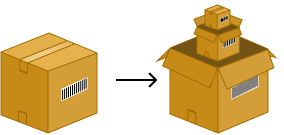

[](https://codecov.io/gh/Akmot9/Packet-parser)
[](https://app.fossa.com/projects/git%2Bgithub.com%2FAkmot9%2FPacket-parser?ref=badge_shield&issueType=security)
[](https://github.com/Akmot9/Packet-parser/actions/workflows/ci.yml)

[](https://crates.io/crates/packet_parser)

# Packet Parser



**Packet Parser** is a powerful and modular Rust crate designed for analyzing and decoding network frames. It provides tools to extract information from various network layers (Data Link, Network, Transport, and Application) and offers an extensible architecture for network monitoring and packet analysis.

## 📌 Features

✅ **Multi-layer Support**: Analyze Data Link, Network, Transport, and Application layers.  
✅ **Data Validation**: Validation mechanisms at every processing stage.  
✅ **Precise Error Handling**: Specific error types for better debugging.  
✅ **Performance Optimization**: Integrated benchmarks using `Criterion`.  
✅ **Extensibility**: Modular architecture for easily adding new protocols.  

Documentation

For full documentation and explanations, check out the [Packet Parser Book](https://akmot9.github.io/packet-parser-book/).


## 🚀 Installation

Add the dependency to your `Cargo.toml`:

```toml
[dependencies]
packet_parser = "0.7.0"
```

Then, import the crate in your project:


## 🔧 Usage

### Example: Parsing an Ethernet Frame

```rust
use packet_parser::parse::data_link::DataLink;

let raw_packet: [u8; 18] = [
    0x2C, 0xFD, 0xA1, 0x3C, 0x4D, 0x5E, // Destination MAC
    0x64, 0x6E, 0xE0, 0x12, 0x34, 0x56, // Source MAC (Intel OUI)
    0x08, 0x00, // Ethertype (IPv4)
    0x45, 0x00, 0x00, 0x54, // Payload (IPv4 Header fragment)
];

let datalink = DataLink::try_from(raw_packet.as_ref()).expect("Failed to parse valid packet");
println!("{:?}", datalink);
```

### Example: Extracting OUI from a MAC Address

```rust
use packet_parser::parse::data_link::mac_addres::{MacAddress, Oui};

let mac = MacAddress([0x64, 0x6E, 0xE0, 0x12, 0x34, 0x56]);
assert_eq!(mac.get_oui(), Oui::Intel);
println!("OUI: {}", mac.get_oui()); // Expected output: Intel
```

## 🛠 Modules

### `parsed_packet`
- **data_link**: Handles Ethernet frame parsing (MAC addresses, Ethertype, etc.).
- **network**: Supports IPv4, IPv6, and other network-layer protocols.
- **transport**: Parses transport layer protocols (TCP, UDP, etc.).
- **application**: Recognizes application layer protocols such as HTTP and DNS.

### `errors`
Provides structured error handling for each network layer.

### `validations`
Ensures data integrity and validity when parsing packets.

### `displays`
Tools for formatting and presenting parsed data in a human-readable way.

## 📊 Tests and Benchmarks

### Running Tests
Unit and integration tests are available in the `tests/` directory. Run all tests using:

```bash
cargo test
```

### Running Benchmarks
Benchmarks are available in the `benches/` directory and use `Criterion`. Execute them with:

```bash
cargo bench
```

## 🤝 Contribution

Contributions are welcome! If you find a bug or want to suggest an enhancement, feel free to open an issue or submit a pull request on GitHub.

### Contribution Guide:
1. Fork the repository.
2. Create a branch for your feature:  
   ```bash
   git checkout -b feature/your-feature-name
   ```
3. Implement and commit your changes:  
   ```bash
   git commit -m "Add feature X"
   ```
4. Push the branch:  
   ```bash
   git push origin feature/your-feature-name
   ```
5. Open a pull request.

## 📜 License

This crate is distributed under the MIT license. See the [LICENSE](LICENSE) file for more information.

---

**Packet Parser** is designed to make network frame analysis efficient and extensible in complex environments. If you have any suggestions or feedback, feel free to reach out! 🚀


